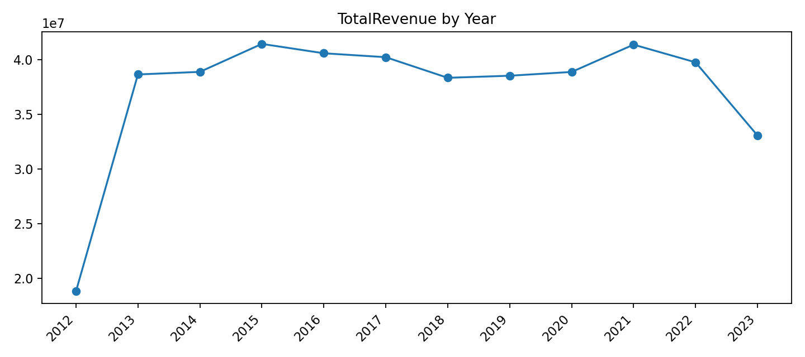

# Results Highlights

This demo shows an agentic NL→SQL workflow over the Northwind SQLite database with retrieval‑grounded schema rules.

## Grounding
- Canonical schema notes: `docs/schema/schema.md`
- Revenue measure (line item): `Quantity * UnitPrice * (1 - Discount)`
- All revenue aggregations: `SUM(...)` at the requested grain

## Key Insight — Yearly Revenue
Artifacts:
- PNG: `out/revenue_by_year.png`  
- CSV: `out/revenue_by_year.csv`  
- Markdown: `out/revenue_by_year.md`  
- Rounded to 2 decimals (nice for charts):  
  - PNG: `out/revenue_by_year_round2.png`  
  - CSV: `out/revenue_by_year_round2.csv`  
  - Markdown: `out/revenue_by_year_round2.md`

Trend (2012–2023): steady growth into mid‑decade, followed by modest variation; 2015 is the peak in this dataset.

## Reproduce Locally

Rebuild the vector index (safe if it already exists):
```powershell
Remove-Item -Recurse -Force "data\vectorstore_lc" -ErrorAction SilentlyContinue
```

Run the yearly revenue query:
```powershell
python .\two_agent_langchain_app.py --q "Total revenue by year. Columns Year, TotalRevenue. Order by Year."
```

Save artifacts (non‑rounded):
```powershell
python .\two_agent_langchain_app.py `
  --q "Total revenue by year. Columns Year, TotalRevenue. Order by Year." `
  --csv out\revenue_by_year.csv `
  --md  out\revenue_by_year.md `
  --plot out\revenue_by_year.png `
  --plot-kind line
```

Save artifacts (rounded to 2 decimals):
```powershell
python .\two_agent_langchain_app.py `
  --q "Total revenue by year. Use ROUND(SUM([Order Details].Quantity * [Order Details].UnitPrice * (1 - [Order Details].Discount)), 2) AS TotalRevenue. Columns Year, TotalRevenue. Order by Year." `
  --csv out\revenue_by_year_round2.csv `
  --md  out\revenue_by_year_round2.md `
  --plot out\revenue_by_year_round2.png `
  --plot-kind line
```

## Packaging

Create the release zip and validate its contents:
```powershell
Remove-Item .\release\northwind-demo.zip -ErrorAction SilentlyContinue
Compress-Archive -Force -DestinationPath .\release\northwind-demo.zip `
  -Path .\out, .\docs, .\two_agent_langchain_app.py, .\data\.env.ini, .\README.md

Expand-Archive -Path .\release\northwind-demo.zip -DestinationPath .\release\unzipped -Force
Get-ChildItem .\release\unzipped\out -File | Measure-Object
```

## Notes
- If you hit Gemini free‑tier 429s, retry after the daily reset, switch to `gemini-1.5-flash-8b`, or set an OpenAI fallback in `data/.env.ini`.
- Keep `SCHEMA_DIR=docs\schema` and treat `data\docs\schema\_archive` as read‑only.

